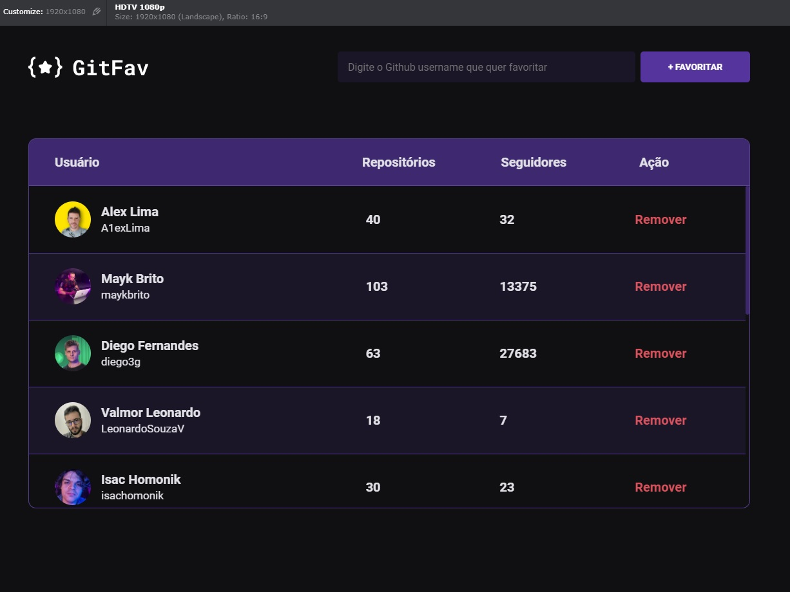
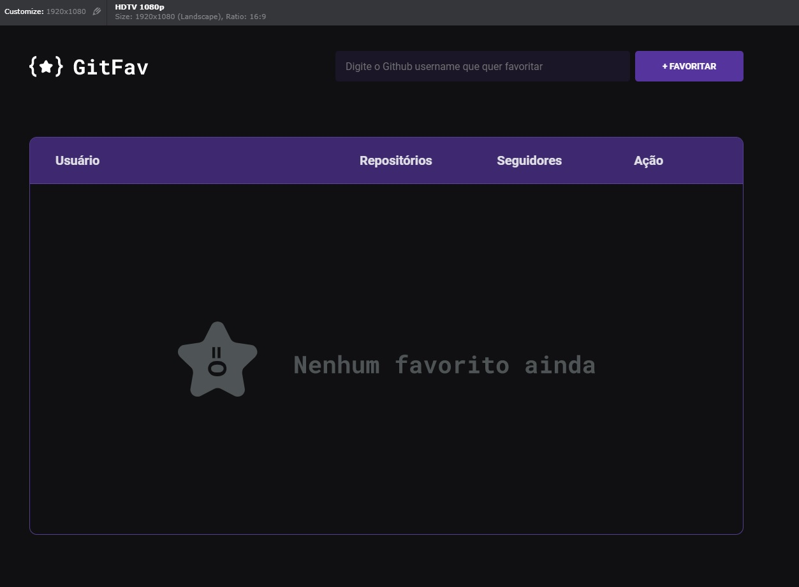

<h1 align="center"> Stage 06 - Javascript antes do framework - Desafio GitFav</h1>

  <a href="#-tecnologias">Tecnologias</a>&nbsp;&nbsp;&nbsp;|&nbsp;&nbsp;&nbsp;
  <a href="#-projeto">Projeto</a>&nbsp;&nbsp;&nbsp;|&nbsp;&nbsp;&nbsp;
  <a href="#-layout">Layout</a>&nbsp;&nbsp;&nbsp;|&nbsp;&nbsp;&nbsp;
  <a href="#memo-licença">Licença</a></a>&nbsp;&nbsp;&nbsp;|&nbsp;&nbsp;&nbsp;
  <a href="#-Deploy">Deploy</a>

 

  

  
  

  

  
  
  

## 🚀 Tecnologias

Esse projeto foi desenvolvido com as seguintes tecnologias:

- HTML e CSS
- Java Script
- Git e Github
- Figma

## 💻 Projeto

 
O que foi abordado nesse desafio:

- Tabelas
- Classes e Herança
- Imutabilidade de dados
- Local Storage
- Promises Async Await
- Try Catch e Throw
- Orientação a objetos;
- Classes e muito mais.
- API (Application Programming Interface) - GitHub
  

## 🔖 Layout

Você pode visualizar o layout do projeto através [DESSE LINK](<https://efficient-sloth-d85.notion.site/GitFav-f8ff1c18b23745c0b46cd8d61f74b596>). É necessário ter conta no [Figma](https://figma.com) para acessá-lo.

## :memo: Licença

Esse projeto está sob a licença MIT.

## 💻 Deploy

Você pode acessar o Website do projeto através do link: 
<a href= "https://a1exlima.github.io/rocketseat-stage6-desafio-gitfav/" target="_blank"> Clique aqui ⏯ </a>

---

Feito com  ♥  by Alex Lima

